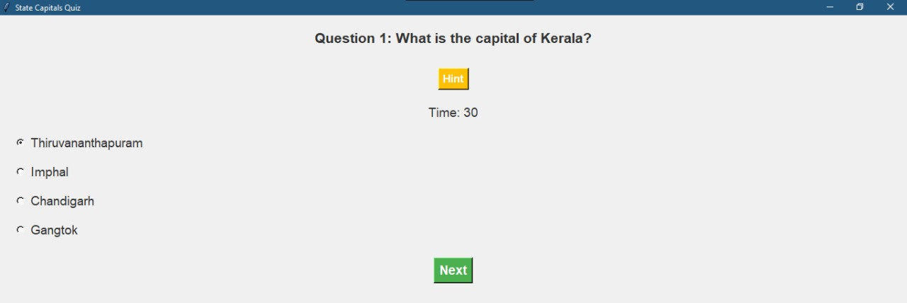
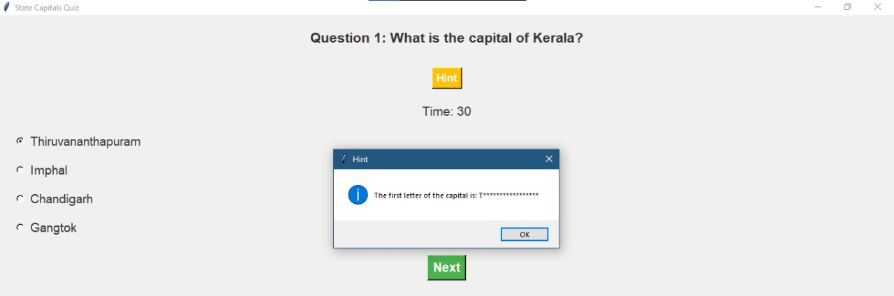

# Smart Assessment Board

## Overview
The Smart Assessment Board is a Python-based quiz application designed for teachers to conduct quiz competitions on identifying states and their capitals in India. This application allows teachers to create quizzes, track scores, and display leaderboards, making it an effective tool for interactive learning.

## Screenshots





## Features
- **Multiple Categories**: The quiz includes various categories like State Capitals, Historical Events, and Famous Personalities.
- **Customizable Quiz**: Teachers can set the number of questions, select categories, and choose difficulty levels (Easy, Medium, Hard).
- **Score Tracking**: The application maintains a leaderboard to track and display the top scores.
- **Hints**: Users can request hints during the quiz.
- **Timer**: Each question has a time limit to enhance the competitive aspect of the quiz.

## Requirements
- Python 3.x
- Tkinter library (comes pre-installed with Python)
- JSON for leaderboard management

## Installation
1. Clone or download the repository.
2. Ensure you have Python installed on your system.
3. Run the application using the command:
   ```bash
   python quiz_app.py

## Usage

1. **Launch the Application:**
   - Run the application script to start the quiz application.

2. **Enter Your Name and Class:**
   - Input your name and class in the provided fields.

3. **Specify the Number of Questions and Select the Quiz Category:**
   - Enter the number of questions you want for the quiz.
   - Choose the quiz category from the dropdown menu.

4. **Start the Quiz and Answer the Questions Within the Time Limit:**
   - Click the "Start Quiz" button to begin.
   - Answer the questions within the allotted time.
   - Use the "Hint" button if you need a clue.

5. **View Your Score and the Leaderboard at the End of the Quiz:**
   - After completing the quiz, review your score and the leaderboard to see how you rank.

## Contribution

Feel free to contribute by:
- **Adding More Categories:** Expand the question bank with new categories or questions.
- **Improving the UI:** Enhance the user interface for a better experience.
- **Enhancing the Scoring System:** Modify the scoring or leaderboard system to include additional features or improvements.
